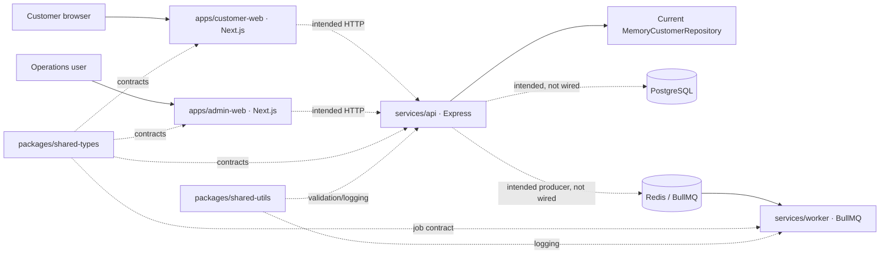

# customer-portal-api — DevOps Modernization Blueprint

Review date: 2 July 2026 (Asia/Kolkata) · Implementation branch: `devops-modernization-2026-07-02`

## Executive Summary

`customer-portal-api` is a young TypeScript/pnpm/Turborepo monorepo with two Next.js apps, an Express API, a BullMQ worker, two shared packages, and starter Docker/Terraform infrastructure. The intended design is service-oriented, but it is not yet an integrated customer platform: the API serves an in-memory repository, the two frontends render local sample data, and the worker is not fed by an API-side queue producer.

The default-branch pipeline is similarly early. It installs dependencies three times across two workflows, runs lint twice, serializes most validation, rebuilds before Playwright, has no dependency or task cache, and publishes no build or coverage artifacts. The first reviewed PR run reached a real NodeNext type-check failure after about 21 seconds. After repairing the repository configuration, the existing baseline completed in 2m21s and the broader modern workflow completed in 3m02s, with lint, type-check, unit, integration, build, Playwright and security jobs green and only the explicit 80% coverage floor red. The modern pipeline adds much stronger feedback, but the first measured run is not a wall-clock improvement. The realistic steady target after a committed lockfile, stable cache reuse and removal of the legacy workflows is about 2m30s.

The proposed workflows make lint, type-check, unit, integration, coverage, and security jobs visible and parallel; cache pnpm and Turborepo state; hand the built Next.js and service output to Playwright; set a hard 80% coverage floor; and add CodeQL, dependency/license review, a production dependency audit, and Gitleaks. An import-extension bug that was blocking every test/build path has also been fixed on the modernization branch.

## Repository Overview

- Repository: `TusharMicro135/customer-portal-api`; public; default branch `main`.
- Architecture: modular monorepo with service-oriented components (hybrid monolith/microservice starter).
- Language/runtime: TypeScript on Node.js 22.
- Package manager: pnpm 9.15.4 workspaces. A `pnpm-lock.yaml` is not committed.
- Build orchestration: Turborepo 2.x; TypeScript; Next.js builds.
- UI frameworks: Next.js 15 and React 19.
- API: Express 5, CORS, Zod validation, and a currently in-memory customer repository. `pg` is declared, and PostgreSQL is provisioned locally, but the API does not use it yet.
- Async processing: BullMQ over Redis via `services/worker`.
- Tests: Jest/ts-jest, Supertest, and Playwright.
- Infrastructure: Docker Compose provides PostgreSQL 16 and Redis 7.4; Terraform contains an AWS VPC starter module.
- Scheduled jobs: none found.

## Branch Review

| Branch | State against `main` at review | Assessment |
|---|---|---|
| `main` | default | Current release line. |
| `develop` | 3 commits behind, no unique commits | Named integration branch, but inactive in content terms until it gets new work. |
| `feature/customer-search` | 3 behind, no unique commits | Placeholder/stale. No customer-search delta exists. |
| `feature/billing-api` | 3 behind, no unique commits | Placeholder/stale. No billing delta exists. |
| `hotfix/auth-token-fix` | 3 behind, no unique commits | Stale; delete after confirming no discussion/incident references. |
| `devops-modernization-2026-07-02` | active; diverged from `main` | The only active human-authored branch with substantive repository changes. |
| `dependabot/npm_and_yarn/production-dependencies-7b50e36493` | 1 ahead | Active automated dependency update. |
| `dependabot/npm_and_yarn/development-dependencies-4e21ff397b` | 1 ahead | Active automated dependency update. |
| `dependabot/github_actions/actions/checkout-7` | 1 ahead, 2 behind | Active automated Actions update; needs rebasing. |
| `dependabot/github_actions/actions/setup-node-6` | 1 ahead, 1 behind | Active automated Actions update; needs rebasing. |
| `dependabot/github_actions/pnpm/action-setup-6` | 1 ahead, 1 behind | Active automated Actions update; needs rebasing. |

In short: the named feature/hotfix branches do not contain work that is absent from `main`; the modernization and current Dependabot branches are the only branches with unique commits.

## Architecture Analysis

The two frontends are separate deployable-looking Next.js apps. They import shared TypeScript contracts but currently render seeded/local data. The Express API exposes health and customer routes and validates IDs/pagination through `shared-utils`; its repository implementation is in memory. PostgreSQL exists in Docker Compose and `pg` is installed, but the connection/repository adapter is not present. The worker does connect to Redis and listens to a `customer-events` queue, but no producer was found in the API. The practical result is a hybrid: good package boundaries inside one monorepo, but runtime service connections are partly aspirational.

Component map:

- `apps/customer-web`: customer Next.js UI on port 3000.
- `apps/admin-web`: internal operations Next.js UI on port 3001.
- `services/api`: Express API on port 4000; health, list, and customer lookup paths.
- `services/worker`: BullMQ welcome-job worker backed by Redis.
- `packages/shared-types`: customer, health, search-result, and queue-job contracts.
- `packages/shared-utils`: structured logger and Zod validation helpers.
- `infrastructure/docker`: API Dockerfile plus PostgreSQL/Redis local Compose stack.
- `infrastructure/terraform`: AWS provider and VPC skeleton; no application workload modules yet.
- No scheduled job/cron package and no migrations/schema directory were found.

## Current Workflow

The default branch has two workflows:

1. `ci.yml`: one `validate` job runs install, lint, type-check, test, and build in series. A dependent `e2e` job checks out again, installs again, rebuilds, installs Chromium, and runs Playwright.
2. `lint.yml`: a separate checkout/install/lint workflow duplicates work already done by `validate`.

The latest PR evidence is useful even though the runs are not green:

- pnpm installed a 518-package graph in roughly 8.5–9 seconds on fresh hosted runners.
- The baseline workflow ran install, lint, and part of type-check in about 21 seconds before TypeScript failed on a missing `.js` suffix in `packages/shared-utils/src/validation.test.ts`.
- Parallel security jobs completed: Dependency Review in about 4 seconds, Gitleaks in about 6 seconds, and CodeQL in about 55 seconds.
- The modernization run also stopped before tests/build for the same NodeNext import failure. The failure is fixed in this branch, so the next run can expose any later issues honestly.

## Pipeline Weaknesses

- No lockfile: installs are not reproducible, GitHub's native pnpm cache cannot key off a lockfile, and dependency review has less stable dependency evidence.
- The baseline CI does three dependency installations and two builds across `ci.yml` and `lint.yml`.
- Lint is duplicated.
- Validation is mostly serialized, so a cheap type failure can hide all later test/build feedback.
- Playwright starts a development server, which discards the intended benefit of a prior production build.
- No build or coverage artifact reuse/retention exists on the default branch.
- No concurrency cancellation means outdated commits continue consuming runner time.
- Turborepo local/remote caching is unused.
- Action versions were already lagging enough that Dependabot opened branches for Checkout 7, Setup Node 6, and pnpm/action-setup 6.
- The workflows have no explicit timeout policy.
- Security checks do not run in the baseline PR path.

## Testing Assessment

Existing tests:

- `packages/shared-utils/src/validation.test.ts`: three Zod validation cases.
- `services/api/test/unit/repository.test.ts`: two in-memory repository cases.
- `services/api/test/integration/api.test.ts`: Supertest coverage for the health/customer surface.
- `services/worker/test/processor.test.ts`: happy-path and malformed-address processor tests.
- `tests/e2e/dashboard.spec.ts`: one customer-dashboard smoke test.

Coverage status:

- No successful coverage artifact or completed coverage run exists, so there is no trustworthy measured overall percentage.
- `services/api/jest.config.cjs` declares a 61% global floor.
- `services/worker/jest.config.cjs` declares a 48% global floor.
- The root Jest config declares 80%, but workspace scripts run package-level Jest commands, and the baseline CI never calls a coverage command.
- Both Next.js apps and `shared-types` use `jest --passWithNoTests`; those gaps can pass silently.
- The modernization workflow sets `[X] = 80` for branches, functions, lines, and statements and fails the coverage job if Jest reports less.

Most important gaps:

- Frontends: no unit/component/a11y coverage; only one customer-dashboard e2e happy path.
- API: no real PostgreSQL integration, auth/authorization, malformed query, error middleware, rate-limit, pagination boundary, or downstream failure tests.
- Worker: no live Redis/BullMQ integration, retry/backoff/idempotency, dead-letter, shutdown, or duplicate-delivery tests.
- Shared types/contracts: no compatibility/schema contract checks.
- Infrastructure: no Docker image health test, Terraform `fmt`/`validate`, or policy tests.

Recommended quality gate sequence: keep the 80% job visible immediately, add focused API/worker state-transition tests and frontend Testing Library/axe tests, then make the coverage result required once every package has meaningful coverage. Drop `--passWithNoTests` as tests are added so an accidentally empty suite cannot report success.

## Security Findings

Default-branch score: **4/10**, two points for each of the five controls the review requested.

| Protection | Default branch | Recommendation |
|---|---|---|
| Dependency scanning/updates | Partial/present: Dependabot for npm and Actions | Commit a reviewed pnpm lockfile; add PR dependency review and a high-severity `pnpm audit --prod` gate. |
| Secret scanning | Missing | Run Gitleaks on PRs and history; separately enable GitHub secret scanning and push protection under repository settings. Add documented rotation/suppression ownership. |
| Static analysis | Missing | Run CodeQL `security-and-quality` for JavaScript/TypeScript on PRs, `main`, `develop`, and weekly. |
| License checks | Missing | Use Dependency Review with a reviewed deny-list (initial proposal: AGPL-3.0, GPL-3.0, SSPL-1.0). Have legal/engineering governance approve the final policy. |
| Code-quality check | Present: ESLint workflow | Keep ESLint and TypeScript as required checks, remove the duplicate lint workflow after the replacement stabilizes, and add CODEOWNERS for workflow/infrastructure changes. |

The modernization branch adds all five workflow-level protections. Repository-level push protection and branch/ruleset enforcement still need to be enabled in GitHub settings after the PR lands.

## Optimization Opportunities and Runtime Estimate

| Work | Current design | Recommended design |
|---|---|---|
| Dependencies | Install three times without a shared cache | Cache the pnpm store by workspace manifests now; switch the key to `pnpm-lock.yaml` as soon as it is committed |
| Validation | Lint, types, tests, and build serialized | Fan out lint, types, unit, integration, and coverage jobs |
| Build | Rebuilt in the e2e job | Upload one verified production build; run Next from that artifact in CI |
| Browser | Install Chromium for every e2e job | Cache Playwright's browser download; still install system dependencies |
| Repeated tasks | Turborepo cache unused | Cache `.turbo`; optionally add remote caching with owned credentials |
| Stale commits | All runs continue | Cancel superseded branch runs with workflow concurrency |
| Debugging | No retained evidence | Retain coverage for 14 days and failing Playwright reports for 7 |

Runtime estimates:

- Existing baseline, measured full PR run: 2m21s (64s validate plus 72s e2e, sequential).
- Modernized first full run: 3m02s wall-clock; the actual dependency chain was about 2m25s before runner-scheduling gaps. Lint, type-check, unit, integration, build, artifact reuse and Playwright passed; the 80% coverage gate failed as expected on packages with missing tests.
- Realistic steady-state target: about 2m30s after committing a pnpm lockfile, switching to frozen lockfile-native caching and removing the two legacy workflows. The first full run shows that parallelization and artifact reuse offset the extra coverage/security scope but do not yet make the broader pipeline faster than the stripped-down baseline.
- Validation method: record the median and p95 of at least ten comparable PR runs and update this target.

## Recommended GitHub Actions Setup

The branch now contains:

- `reusable-build.yml`: a read-only, task-whitelisted Node 22/pnpm 9.15.4 bootstrap with manifest-keyed pnpm cache, Turborepo cache, job timeouts, and verified build publication.
- `ci-modernized.yml`: parallel lint, type-check, unit, integration, and coverage jobs; an 80% coverage floor; a single build fan-in; a Playwright job that downloads and runs the production Next.js build; browser caching; artifact retention; PR/push/manual triggers; and stale-run cancellation.
- `security.yml`: CodeQL `security-and-quality`, Dependency Review with license policy, a production high-severity pnpm audit, and Gitleaks, with PR/push/schedule/manual triggers.

The build artifact contains Next.js `.next` output and the service/package `dist` directories; Playwright downloads it and `playwright.config.ts` chooses `next start` under CI rather than triggering a development rebuild.

## Branch Protection Recommendations

For `main` and `develop`:

- Require pull requests, resolved conversations, and one approval for application work. Require two approvals plus CODEOWNERS approval when `.github/**` or `infrastructure/**` changes.
- Require the visible checks for lint, type-check, unit, integration, coverage, build, Playwright, CodeQL, dependency/license review, dependency audit, and Gitleaks. Add the coverage check after the test-improvement ticket brings real package coverage to 80%; do not waive it quietly.
- Prevent force pushes and branch deletion. Require linear history and apply the ruleset to administrators except for a documented break-glass role.
- Require branches to be current with `main` before merge and let GitHub dismiss stale approvals when workflow or dependency manifests change.

## Implementation Roadmap

1. Fix the current build/test blocker and land deterministic workflow setup, caching, artifacts, security checks, and concurrency controls.
2. Commit a pnpm lockfile and switch every install to `--frozen-lockfile`; rebase or close the now-overlapping Dependabot action-upgrade branches.
3. Replace in-memory API storage with a tested PostgreSQL adapter and wire the API-side BullMQ producer; add Testcontainers-backed integration coverage.
4. Add web component/a11y tests and worker retry/idempotency tests until each package meets the 80% floor.
5. Remove the baseline `ci.yml` and `lint.yml` after the replacement is green and stable; enable required checks/rulesets.
6. After ten representative runs, publish median/p95 duration, cache-hit ratio, flake rate, and coverage trend.

## Risks

- The 80% target is intentionally a target, not a measured baseline. The final run proves the gate is active and currently blocks on missing coverage; making it required before missing suites are added will block delivery.
- A manifest-only cache key is a temporary accommodation for the missing pnpm lockfile and can return a broader cache than a lockfile key.
- The current integration tests do not exercise the deployed architecture implied by Docker Compose; they can stay green while PostgreSQL/Redis wiring is broken or absent.
- Pull requests that only add workflow files can make CodeQL/Gitleaks look “present” before branch protection and default-branch push protection are actually enforced.
- Gitleaks history scans may expose historic credentials that need rotation, not just suppression.
- Automated major action upgrades should be reviewed together after this PR so the Dependabot branches do not repeatedly conflict.

## Migration Checklist

- [x] Inventory all branches and compare them with `main`.
- [x] Add parallel, cache-aware CI and independent security workflows on `devops-modernization-2026-07-02`.
- [x] Fix the NodeNext import that blocked type-check, tests, and builds.
- [x] Configure an explicit 80% coverage check and short-lived test/build artifacts.
- [x] Run Playwright from the verified production build in CI.
- [ ] Generate and commit `pnpm-lock.yaml` with Node 22/pnpm 9.15.4; use `--frozen-lockfile` everywhere afterward.
- [ ] Bring API, worker, frontend, and shared-package tests to the enforced coverage floor and record real reports.
- [ ] Exercise PostgreSQL and Redis/BullMQ through integration tests rather than in-memory stand-ins alone.
- [ ] Enable GitHub secret scanning/push protection and the recommended branch rulesets.
- [ ] Remove `ci.yml` and `lint.yml` once the replacement is green and required.
- [ ] Pin third-party action revisions after verifying Dependabot's major-version branches.
- [ ] Record ten comparable workflow runs and publish median/p95 values; the first complete runs were 2m21s baseline and 3m02s modernized.
- [ ] Keep the Jira epic, Health Tracker row, Google Doc, and Slack handoff linked from the PR.
